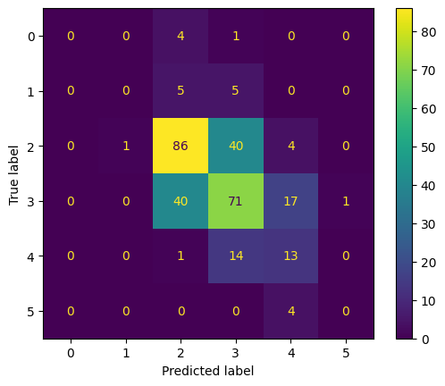

# Term Project #1

>   Introduction to Machine Learning

- [Before Started](#before-started)
- [Report](#report)
  * [Introduction](#introduction)
    + [Wine Quality Data Set](#wine-quality-data-set)
    + [Sentiment Analysis On Movie Reviews](#sentiment-analysis-on-movie-reviews)
  * [Data Preprocessing](#data-preprocessing)
    + [Wine Quality Data Set](#wine-quality-data-set-1)
    + [Sentiment Analysis On Movie Reviews](#sentiment-analysis-on-movie-reviews-1)
  * [Decision Tree](#decision-tree)
    + [Implementation](#implementation)
  * [Evaluation](#evaluation)

## Before Started

-   Since I use IPython for this project, I wrote some usefull information in the notebook. If it is not clear enough in this report, please refer to the descriptions I wrote besides the source code.
-   This project is uploaded to [GitHub](https://github.com/lolainta/NYCU-ML-2022-Fall/tree/main)

# Report

## Introduction

### Wine Quality Data Set

In this problem, we are given a dataset of wine characteristics and the corresponding quality ratings. Our goal is to build a model that can predict the quality of a wine based on its characteristics.

### Sentiment Analysis On Movie Reviews

In this problem, we are given a dataset of movie reviews and the corresponding sentiment (positive or negative). Our goal is to build a model that can classify a movie review as positive or negative based on its text.

## Data Preprocessing

Since the real world data is dirty, which means that it may consists of some missing value. Therfore, we need to preprocess the data in order to improving the quality of the data.

### Wine Quality Data Set

I simply replace the missing value with the median of that descriptive featrue in this problem. 

The reason I choose to replace the missing value with the median of that descriptive feature is because I had used the [ProfileReport](https://pandas-profiling.ydata.ai/docs/master/pages/reference/api/_autosummary/pandas_profiling.profile_report.ProfileReport.html#pandas_profiling.profile_report.ProfileReport) and find out that the absolute value of the skewness of those missing features are pretty high. And that median value is a robust statistic that is resistant to the influence of outliers. Thus I think it is more appropriate choice than the mean when the data in this situation.

Moreover, replacing missing values with the median can help to improve the performance as it not only allows the model to make better use of the available data, but also reduce the risk of introducing bias into the model, as the median is less sensitive to the influence of outliers than the mean.

The method I replace the missing value is by simply calling the [fillna](https://pandas.pydata.org/docs/reference/api/pandas.DataFrame.fillna.html) function. As shown below

```pyt
X_train.fillna(X_train.median(),inplace=True)
```

### Sentiment Analysis On Movie Reviews

For the Sentiment Analysis on Movie Reviews problem, I used sample code provided by my TA for the data preprocessing step. The reason is that I am not familiar at setiment analyzing and our course also did not teach us anything about that, thus it is a big challenge for me to construct my own method to analze these phrases. 

However, after preprocessing those data, the remaining are the same as the previous problem.

## Decision Tree

Decision trees are a type of supervised machine learning algorithm that can be used for both classification and regression tasks. They work by constructing a tree-like model of decisions based on features of the data, with each internal node representing a test on a feature and each leaf node representing a class label. Our goal is to create a model that accurately predicts the class label of new data based on the feature values.

### Implementation

This decision tree is a normal decision tree. However, it is written with object-oriented programming (OOP) techniques. Thus, it is modularity, its code is reusable and it can also be constructed and used in a high-level logic, without knowing the implementation details. However, it will contain more overhead when executing and cost more memory.

There are only one hyper parametes of my decision tree `depth`. The decision tree can be constructed by the following example.

```
DecisionTreeClassifier(depth=5,target_feature=target_feature)
```

The first parameter `depth` means the max depth of this decision tree an grow. Note that it does not grarentee that the tree will grow to the max depth. For example, if you set the max depth to a infinitly large number, it will only grew untill it finds every nodes are leaf node, which means that every data under the node are in the same target class.

Note that since the data set is many times larger than the previous problem. I also implemented K-fold for this problem so as to reduce the data size for training.

## Evaluation 

To evaluate the performance of our decision tree model, I used a number of evaluation metrics. First, I used a confusion matrix to visualize the model's predictions. A confusion matrix is a table that shows the number of true positive, true negative, false positive, and false negative predictions made by the model. 

The following confusion matrix shows the results of our decision tree model on the wine quality data set:



From the confusion matrix, we can see that the model made a total of $307$ predictions. Of these predictions, $0$ were true positives for class 0, $306$ were true negatives for class 0, $5$ were false positives for class 0, and $302$ were false negatives for class 0. Similarly, there were $0$ true positives, $307$ true negatives, $1$ false positives, and $306$ false negatives for class 1, and so on for each class.

Using the values in the confusion matrix, we can compute a number of evaluation metrics to get a better understanding of the model's performance. The first metric we will consider is accuracy. Accuracy is the proportion of correct predictions made by the model, and is calculated as:

$$\text{accuracy} = \frac{\text{true positives} + \text{true negatives}}{\text{total predictions}}$$

For our model, the overall accuracy is $0.5537$. This means that the model was able to correctly classify $0.5537$ of the instances in the test set.

Another important evaluation metric is precision. Precision is the proportion of true positive predictions made by the model among all positive predictions. It is calculated as:

$$\text{precision} = \frac{\text{true positives}}{\text{true positives} + \text{false positives}}$$

Recall, also known as sensitivity or true positive rate, is the proportion of true positive predictions made by the model among all actual positive instances in the dataset. It is calculated as:

$$\text{recall} = \frac{\text{true positives}}{\text{true positives} + \text{false negatives}}$$

Finally, the F1 score is the harmonic mean of precision and recall. It is calculated as:

$$\text{F1 score} = 2 * \frac{\text{precision} * \text{recall}}{\text{precision} + \text{recall}}$$

In addition to the overall evaluation metrics, it is also useful to consider the performance of the model for each class individually. The following table shows the precision, recall, and F1 score for each class:

| class | precision | recall | f1-score | support |
| :---: | :-------: | :----: | :------: | :-----: |
|   3   |   0.00    |  0.00  |   0.00   |    5    |
|   4   |   0.00    |  0.00  |   0.00   |   10    |
|   5   |   0.63    |  0.66  |   0.64   |   131   |
|   6   |   0.54    |  0.55  |   0.55   |   129   |
|   7   |   0.34    |  0.46  |   0.39   |   28    |
|   8   |   0.00    |  0.00  |   0.00   |    4    |
